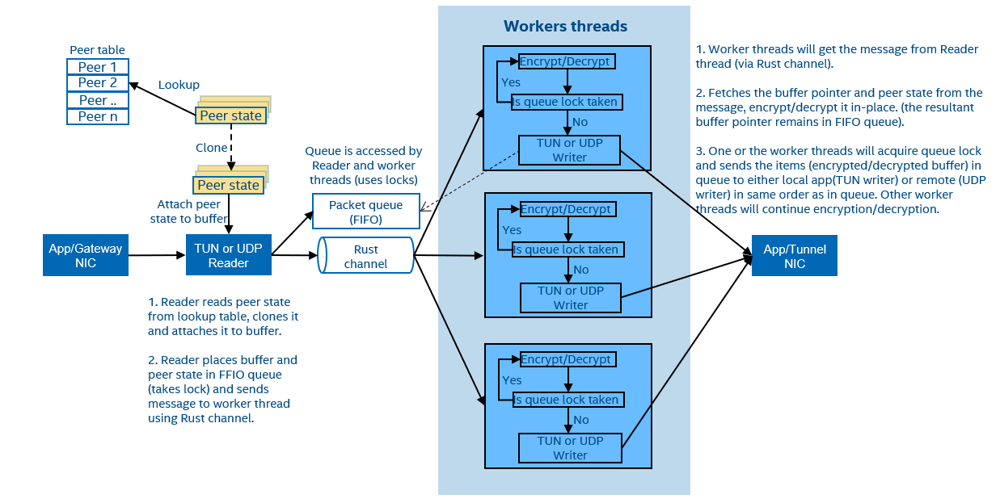

..  SPDX-License-Identifier: BSD-3-Clause
    Copyright (c) 2019-2023 Intel Corporation.

Wireguard Rust user space
=========================

.. _Wireguard_overview:

WireGuard
----------

WireGuard is an extremely simple yet fast and modern VPN that uses state-of-the-art cryptography.
Wireguard Rust is a user space implementation of the wireguard protocol. It's maintained in GitHub
at `wireguard-rs <https://github.com/WireGuard/wireguard-rs/>`_.

WireGuard Rust user space with FGEN
-----------------------------------

Wireguard Rust user space implementation uses FGEN/AF-XDP to send and receive packets from/to user
space FGEN/AF-XDP replaces existing linux networking stack used to send/receive WireGuard UDP
packets. Wireguard Rust with FGEN will run on Linux platform. WireGuard FGEN application runs as a
background process and by default uses WireGuard kernel TUN interface to read/write packets from TUN
interface. It uses FGEN API's to send and receive UDP packets.

.. _Wireguard_FGEN_custom_app:

A custom linux application is also implemented on top of Wireguard and FGEN stack which uses Rust
channel instead of Kernel TUN interface for data path. Control path still uses Kernel TUN interface
to configure local and peer encryption keys, ip addresses, peer end point etc.

.. figure:: img/WG_FGEN.png

.. figure:: img/WG_FGEN_Custom_app.png

WireGuard Rust High level flow
-------------------------------

High level flow of Wireguard Rust is shown in below diagram. Here UDP reader and writer uses FGEN
APIs to receive and send WireGuard UDP packets.

Wireguard FGEN performance measurement setup using DPDK PktGen
---------------------------------------------------------------

Flow traffic configuration setup which is used to measure Wireguard FGEN performance is shown in
below diagram. This uses custom Wireguard FGEN application described in
:ref:`Custom Wireguard <Wireguard_FGEN_custom_app>`

.. figure:: img/WG_FGEN_Traffic_Flow.png

Setup WireGuard Rust with FGEN
------------------------------

Clone the Wireguard Rust repo and checkout the commit on which the patches are based:

.. code-block:: console

  git clone https://github.com/WireGuard/wireguard-rs.git
  cd wireguard-rs
  git checkout 7d84ef9

Apply the Wireguard FGEN patches in lang/rs/wireguard/patch. Ignore the whitespace warning errors.

.. code-block:: console

  git am *.patch

Build Wireguard with FGEN

.. code-block:: console

  cargo build --release

In Wireguard repo, refer to src/platform/linux/fgen/README.md file under usage section to configure
and start Wireguard with FGEN.

Future work
-----------
Currently network I/O performance in WireGuard Rust is optimized by using FGEN/AF-XDP. There are
other opportunities for performance optimization like chacha20-poly1305 encryption/decryption, using
lockless queue implementation (using DLB or lockless ring).
